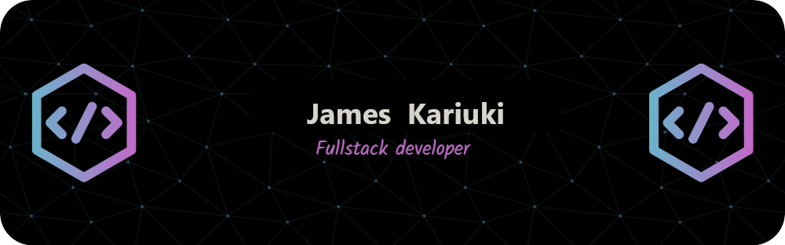

<!-- My Socials -->

  
  
  

 

# Hello there, I am James 👋 

I am a Software engineer, open to collaborating on development projects.

I am a proud Alumni of the African Leadership X (ALX) software engineering program, crafted by Holberton School and sponsored by ALX Africa in partnership with the Mastercard Foundation. The program has been a key pillar in my tech journey and expanding my knowledge of modern development technologies.
#DoHardThings

  

## 🔭 My GitHub Stats

 

  

## 📫 How to Reach Me

You can reach me via email at [karisjaymo99@gmail.com](mailto:karisjaymo99@gmail.com) or connect with me on [LinkedIn](https://www.linkedin.com/in/kariuki-jm/).

Thank you for stopping by.
